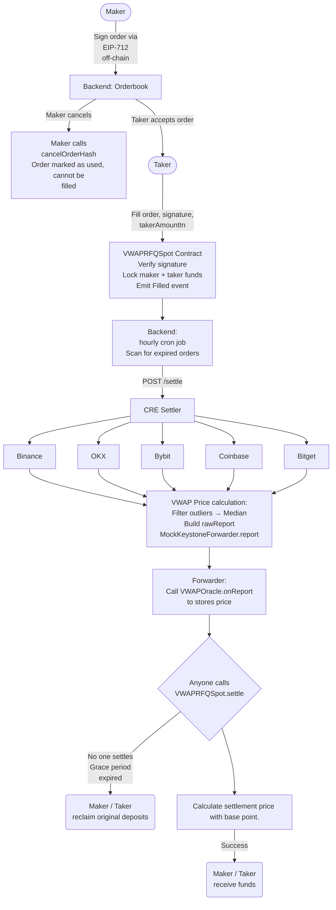

# Chainlink CRE — VWAP RFQ Spot

A settlement-grade 12h VWAP oracle for delayed RFQ spot trading, built on Chainlink CRE.

---

## Settlement Flow



---

## Repository Structure

```
.
├── vwap-eth-quote-flow/        # CRE Workflow (Go) — VWAP computation + on-chain write
│   ├── workflow.go             # Main workflow logic
│   ├── workflow_test.go        # Unit tests
│   ├── config.staging.json     # Staging config (oracle address, circuit breaker params)
│   └── workflow.yaml           # CRE CLI target settings
├── contracts/evm/              # Solidity contracts
│   ├── src/
│   │   ├── VWAPRFQSpot.sol             # Main exchange: fill / settle / refund
│   │   ├── ChainlinkVWAPAdapter.sol    # Production oracle (CRE Forwarder + IReceiver)
│   │   ├── ManualVWAPOracle.sol        # Staging oracle (onReport + setPrice backdoor)
│   │   └── IVWAPOracle.sol             # Oracle interface
│   └── deploy.sh               # Deploy script (ORACLE_MODE=manual|chainlink)
├── cmd/
│   ├── trigger/                # Signs and sends HTTP POST to CRE DON endpoint
│   └── server/                 # Settler HTTP server (POST /settle, GET /health)
├── scripts/                    # simulate.sh, simulate-and-forward.sh, demo-vtn.sh
└── project.yaml                # CRE CLI project settings (RPC, chain targets)
```

---

## Contracts

| Contract | Description |
|----------|-------------|
| `VWAPRFQSpot.sol` | Main RFQ exchange — `fill` / `settle` / `refund` |
| `ChainlinkVWAPAdapter.sol` | Production oracle — receives signed reports from CRE Forwarder via `IReceiver` |
| `ManualVWAPOracle.sol` | Staging oracle — accepts reports via `onReport` and owner `setPrice` backdoor |
| `IVWAPOracle.sol` | Interface shared by both oracle implementations |

### MockForwarder vs Production CRE

| | Staging (current) | Production |
|-|-------------------|------------|
| Oracle | `ManualVWAPOracle` | `ChainlinkVWAPAdapter` |
| Forwarder | `MockKeystoneForwarder` | CRE Forwarder |
| Signature verification | None | F+1 DON signatures |
| Report source | `simulate-and-forward.sh` | Live CRE DON |

---

## Deployed Contracts (Sepolia)

| Contract | Address |
|----------|---------|
| ManualVWAPOracle | [`0xd7D42352bB9F84c383318044820FE99DC6D60378`](https://sepolia.etherscan.io/address/0xd7D42352bB9F84c383318044820FE99DC6D60378) |
| VWAPRFQSpot | [`0x61A73573A14898E7031504555c841ea11E7FB07F`](https://sepolia.etherscan.io/address/0x61A73573A14898E7031504555c841ea11E7FB07F) |
| MockKeystoneForwarder | [`0x15fC6ae953E024d975e77382eEeC56A9101f9F88`](https://sepolia.etherscan.io/address/0x15fC6ae953E024d975e77382eEeC56A9101f9F88) |

---

## Quick Start

### Prerequisites

- [Go](https://go.dev) 1.21+
- [Foundry](https://getfoundry.sh) (`forge`, `cast`)
- [CRE CLI](https://docs.chain.link/cre/getting-started/installation) (`cre`)

### Environment

```bash
cp .env.example .env
```

Required variables:

```bash
DEPLOYER_PRIVATE_KEY=0x...      # Signs on-chain transactions
MANUAL_ORACLE_ADDRESS=0x...     # ManualVWAPOracle deployed address
RPC_URL=...                     # Sepolia or Tenderly VTN RPC
```

### Run Tests

```bash
# CRE workflow unit tests
cd vwap-eth-quote-flow && go test -v

# Solidity contract tests
cd contracts/evm && forge test
```

### Simulate CRE Workflow (no account needed)

```bash
# Simulate past 12h window (defaults to now)
./scripts/simulate.sh

# Simulate specific end time
./scripts/simulate.sh "2025-02-15 15:00"
```

### Simulate + Write On-chain

```bash
# Simulate and route report through MockKeystoneForwarder → onReport()
./scripts/simulate-and-forward.sh

# With Tenderly VTN
RPC_URL=$TENDERLY_ADMIN_RPC ./scripts/simulate-and-forward.sh
```

### Deploy Contracts

```bash
cd contracts/evm

# Staging (ManualVWAPOracle + VWAPRFQSpot)
ORACLE_MODE=manual ./deploy.sh

# Production (ChainlinkVWAPAdapter + VWAPRFQSpot)
ORACLE_MODE=chainlink ./deploy.sh
```

### Verify On-chain Price

```bash
cast call $MANUAL_ORACLE_ADDRESS \
  "getPrice(uint256,uint256)(uint256)" \
  $START_TIME $END_TIME \
  --rpc-url $RPC_URL
```

---

## Scripts

| Script | Description |
|--------|-------------|
| `scripts/simulate.sh` | Run CRE simulate, print VWAP result — no on-chain write |
| `scripts/simulate-and-forward.sh` | Simulate + submit rawReport via MockKeystoneForwarder |
| `scripts/demo-vtn.sh` | Create demo orders on Tenderly VTN in four settlement states |

---

## Chainlink Integration

| File | Description |
|------|-------------|
| [`vwap-eth-quote-flow/workflow.go`](./vwap-eth-quote-flow/workflow.go) | CRE Workflow: HTTP trigger, multi-exchange VWAP, circuit breakers, OCR write |
| [`vwap-eth-quote-flow/workflow.yaml`](./vwap-eth-quote-flow/workflow.yaml) | CRE CLI workflow config |
| [`project.yaml`](./project.yaml) | CRE CLI project settings (RPC, chain targets) |
| [`cmd/trigger/main.go`](./cmd/trigger/main.go) | Backend trigger: ECDSA-signed HTTP POST to CRE DON |
| [`contracts/evm/src/ChainlinkVWAPAdapter.sol`](./contracts/evm/src/ChainlinkVWAPAdapter.sol) | Production oracle — implements Chainlink `IReceiver` |
| [`contracts/evm/src/keystone/IReceiver.sol`](./contracts/evm/src/keystone/IReceiver.sol) | Chainlink Keystone `IReceiver` interface |
